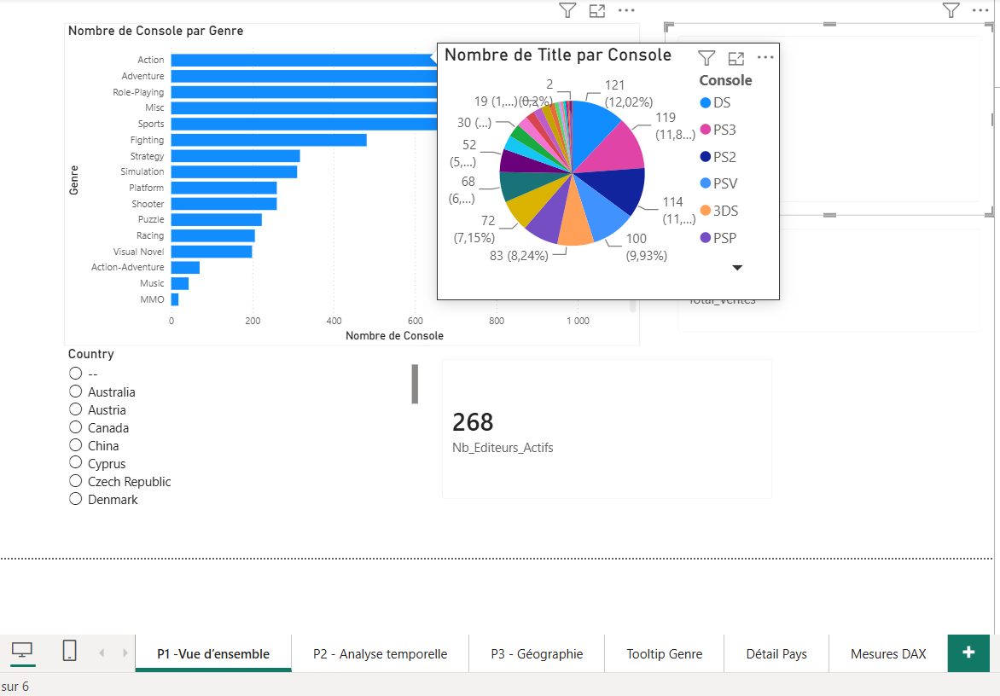
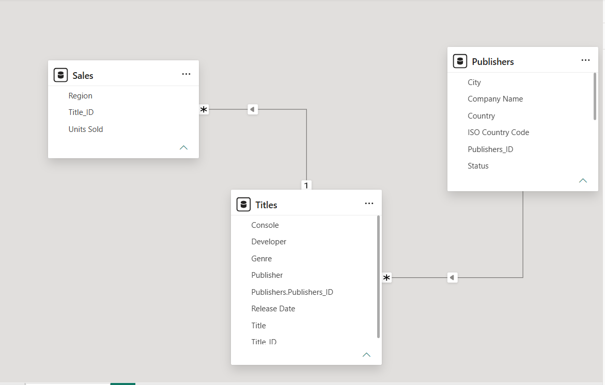
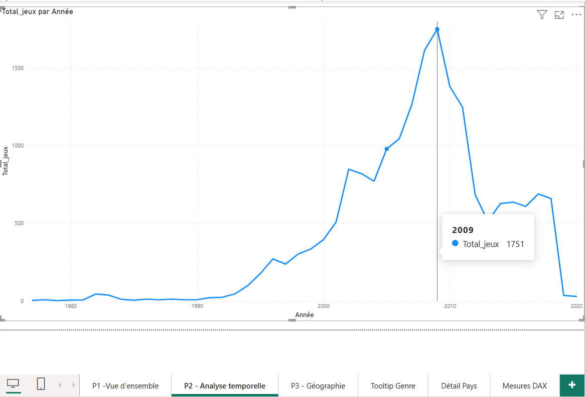
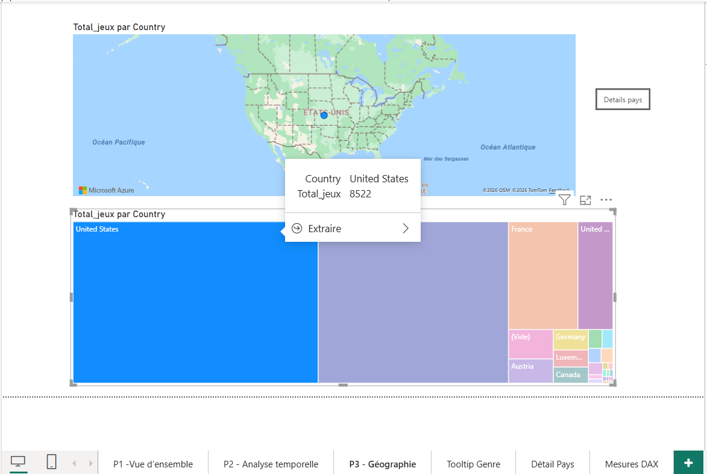
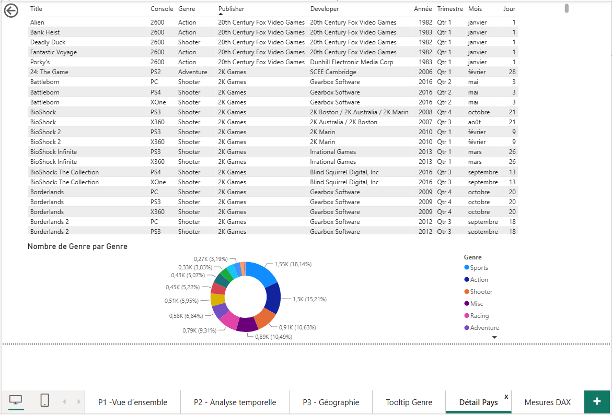

# Video Game Sales Dashboard

The video game industry has grown across decades, platforms, and continents. I built this interactive Power BI dashboard on a multi-table video game dataset to explore what gets made, where, when, and how it sells — backed by a proper star-schema data model rather than a single flat table.



## Dataset

Three related tables:

- **Publishers** — publisher details and country
- **Titles** — one row per game (title, console, genre, publisher, developer, release date)
- **Sales** — sales records linked to each title

Together they cover thousands of game titles across multiple platforms, genres, publishers, countries, and release years, published by 268 active publishers. _(Link to the source dataset here.)_ The raw file isn't committed — the `.pbix` and screenshots tell the story.

## Tools

**Power BI / DAX** — data modeling, measures, and an interactive multi-page report.

## Data model

Rather than working from one flat table, I modeled the three tables into a star schema and set the relationships explicitly:

- `Publishers[Publishers_ID]` → `Titles[Publishers_ID]` — one-to-many (one publisher, many titles)
- `Titles[Title_ID]` → `Sales[Title_ID]` — one-to-many (one title, many sales records)

This keeps the model clean, avoids duplication, and lets a single slicer (e.g. country) filter every visual on a page consistently.



## What the dashboard shows

The report is built as several linked pages, each answering a different question.

**Overview.** Games by genre as a horizontal bar chart, KPI cards for total games, total sales, and active publishers, and a country slicer that filters the whole page. It's the landing view — the big picture at a glance.

**Releases over time.** A line chart of game releases by year makes the industry's arc clear at a glance: output stayed low through the 1980s and early 1990s, climbed steeply through the 2000s, peaked in **2009 (1,751 titles)**, then dropped sharply into the 2010s.



**Geography.** A map sizing each country by the number of games produced, plus a treemap of the top producers. Production is dominated by the **United States (8,522 titles)**, far ahead of the next publisher countries (France, Germany, Austria, and Canada among them).



**Country drillthrough.** Right-clicking a country drills through to a detail page listing every title (with console, genre, publisher, developer, and release date) alongside a donut chart of that country's genre mix — so you can move from the big picture straight to the underlying records.



## Interactive features

A few things I built in that go beyond a static report:

- **Star-schema modeling** with explicit one-to-many relationships across three tables
- **DAX measures** — total games, average sales per record, and genre-specific counts
- **Slicers** for cross-filtering a whole page (e.g. by country)
- **Custom page tooltips** — hovering a genre reveals a console-breakdown chart, giving a second layer of detail without cluttering the main visual
- **Drillthrough with a button** — jump from a country on the map to its full detail page

Custom tooltips and drillthrough are worth highlighting: default tooltips only repeat a value, whereas a tooltip page can show a whole mini-visual on hover, and drillthrough turns a summary chart into an entry point for record-level exploration.

## Key findings

- Game releases climbed steeply through the 2000s and peaked in **2009 (1,751 titles)** before falling sharply — a curve that mirrors the industry's expansion and the later shift toward fewer, bigger releases and digital distribution.
- Production is heavily concentrated in the **United States (8,522 titles)**, well ahead of every other publisher country.
- **Action and Sports** are the two most-produced genres, and the **DS, PS3, and PS2** are the most common platforms in the catalog.

## Repository structure

```
video-games-sales-dashboard/
├── README.md
├── images/
│   ├── overview-by-genre.png
│   ├── data-model.png
│   ├── releases-over-time.png
│   ├── games-by-country-map.png
│   └── country-drillthrough.png
└── video-games-sales-dashboard.pbix
```

## What I'd explore next

The current dashboard focuses on *counts* of games; a natural extension is to weight by *sales* — which genres, platforms, and publishers actually generate the most revenue, not just the most titles — and to look at how the dominant genre or platform shifts across eras.
